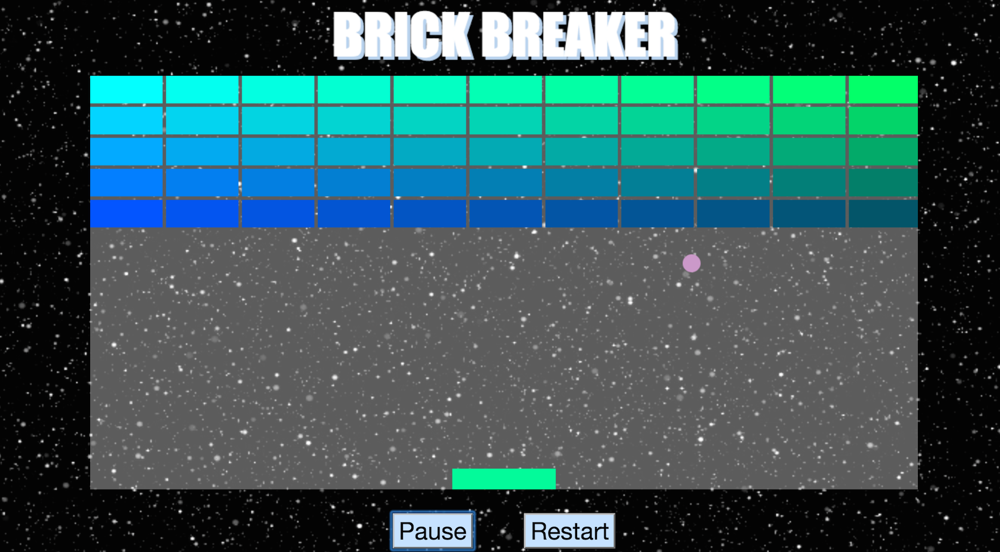

#Brick Breaker  
  

###Game Link: 
[Play Me!](http://yaelamir.github.io/project1/ "Play Me!")

###Developer:  
#####Yael Amir  

###History:
Breakout is an arcade game developed and published by Atari, Inc.[2] It was conceptualized by Nolan Bushnell and Steve Bristow, influenced by the 1972 Atari arcade game Pong, and built by Steve Wozniak aided by Steve Jobs. The game was ported to multiple platforms and upgraded to video games such as Super Breakout. 
###Description:  
In the game, a layer of bricks lines the top third of the screen. A ball travels across the screen, bouncing off the top and side walls of the screen. When a brick is hit, the ball bounces away and the brick is destroyed. The player loses when the ball touches the bottom of the screen. To prevent this from happening, the player has a movable paddle to bounce the ball upward, keeping it in play. 

The player must smash the wall of bricks by deflecting the bouncing ball with a paddle. The paddle moves horizontally and is controlled with left and right arrow keys. The player wins when all the bricks have been smashed.

To begin playing, click the 'start' button at the bottom of the page.

###Features:
- Start button
- Pause button
- Resume button
- Refresh button

###Technologies:
- HTML5
- CSS
- JS
- Canvas elements

###Design:
Arcade Design
###Next Steps:
- Create levels that progress in speed, difficulty, and features as well as changes the pattern and color scheme of bricks
- Add items that fall out of bricks that you will either help you win or not so user must decide quickly if to catch it or not
- Store users scores and high scores
- Add trailing effect to mouse
- Change the look of the paddle
- Click release the ball to begin game

###Installation:
1. Open your favorite browser
2. Copy paste this link to your url browser [http://yaelamir.github.io/project1/](http://yaelamir.github.io/project1/)
  

###Trello:  
[Trello Link](https://trello.com/b/QE8dZbrC/brick-breaker "Trello")

