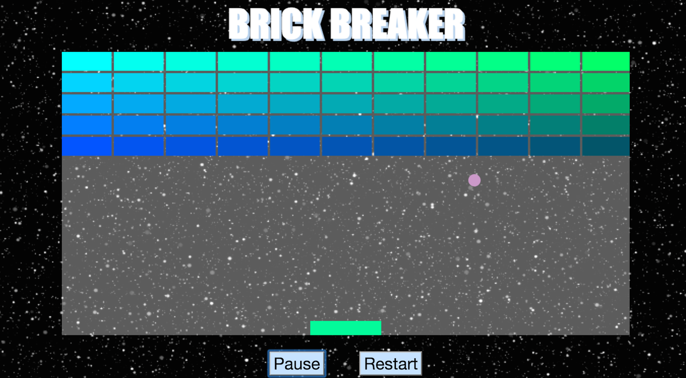

#Brick Breaker  
  

##Developer:  
###Yael Amir  

##Description:  
The goal is to catch the ball with the paddle in order to break all the bricks. If the ball isn't caught - GAME OVER. 

The player must smash the wall of bricks by deflecting a bouncing ball with a paddle. The paddle moves horizontally and is controlled with left and right arrow keys. The player wins when all the bricks have been smashes.

####Disclaimer:  
If you have sensitive eyes, this game is not recommended for you!

